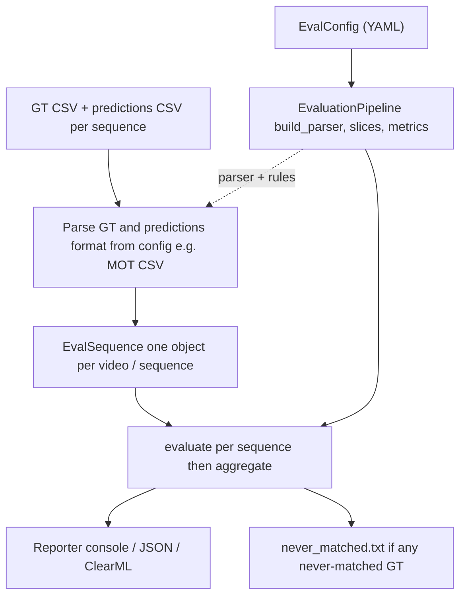
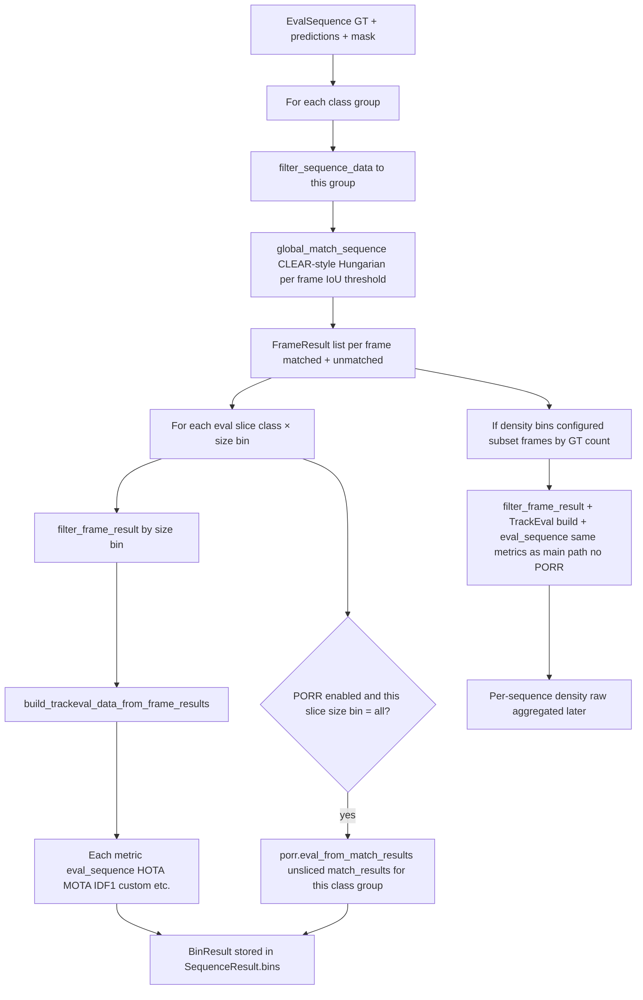
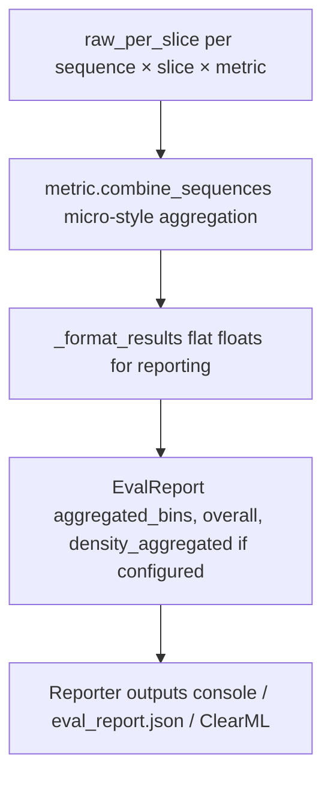

# Evaluation Module

This module implements a multi-object tracking (MOT) evaluation pipeline that goes beyond standard academic benchmarks. It combines established TrackEval metrics (HOTA, MOTA, IDF1) with custom surveillance-oriented metrics designed to capture real-world tracker behaviour: detection initiation, ID stability under occlusion, and track coverage fidelity.

All metrics share a common CLEAR-style Hungarian matching backend (IoU threshold + temporal continuity bonus), ensuring consistent GT-to-prediction assignment across the entire evaluation suite.

---

## Table of Contents

1. [Metrics Reference](#metrics-reference)
   - [HOTA — Higher Order Tracking Accuracy](#hota--higher-order-tracking-accuracy)
   - [MOTA — Multiple Object Tracking Accuracy](#mota--multiple-object-tracking-accuracy)
   - [IDF1 — ID F1 Score](#idf1--id-f1-score)
   - [Track Coverage](#track-coverage)
   - [Probability of Detection (PD)](#probability-of-detection-pd)
   - [ID Instability Rate](#id-instability-rate)
   - [Post-Occlusion Recovery Rate (PORR)](#post-occlusion-recovery-rate-porr)
   - [False Alarm Rate (FAR)](#false-alarm-rate-far)
2. [Quality Responsibility Matrix](#quality-responsibility-matrix)
3. [Evaluation Slices](#evaluation-slices)
   - [Per Object Size](#per-object-size)
   - [Per Object Class](#per-object-class)
   - [Per Frame Density](#per-frame-density)
   - [Slicing Modes](#slicing-modes)
4. [Plots and Reports](#plots-and-reports)
5. [Evaluation pipeline flow](#evaluation-pipeline-flow)

---

## Metrics Reference

### HOTA — Higher Order Tracking Accuracy

**Source:** TrackEval (`trackeval.metrics.hota`)

**What it measures:**
HOTA jointly evaluates detection and association quality in a single unified score. Unlike MOTA (detection-biased) or IDF1 (association-biased), HOTA balances both equally via geometric mean.

**Equations:**

For a given IoU threshold $\alpha$:

$$
\text{DetA}_\alpha = \frac{|TP_\alpha|}{|TP_\alpha| + |FN_\alpha| + |FP_\alpha|}
$$

$$
\text{AssA}_\alpha = \frac{1}{|TP_\alpha|} \sum_{c \in TP_\alpha} \frac{|TPA(c)|}{|TPA(c)| + |FNA(c)| + |FPA(c)|}
$$

$$
\text{HOTA}_\alpha = \sqrt{\text{DetA}_\alpha \cdot \text{AssA}_\alpha}
$$

The final reported HOTA is averaged over 19 IoU thresholds from 0.05 to 0.95:

$$
\text{HOTA} = \frac{1}{19} \sum_{\alpha \in \{0.05, 0.10, \ldots, 0.95\}} \text{HOTA}_\alpha
$$

Where:
- **TP** = true positive detections at threshold $\alpha$
- **TPA(c)** = true positive associations for match cluster $c$
- **FNA(c)**, **FPA(c)** = false negative/positive associations for cluster $c$

**Interpretation:** Higher is better. Range $[0, 1]$. A tracker needs both good detection and good association to score well.

---

### MOTA — Multiple Object Tracking Accuracy

**Source:** TrackEval (`trackeval.metrics.clear`)

**What it measures:**
The classic CLEAR MOT metric. Summarises frame-level detection quality by penalizing false positives, false negatives, and ID switches.

**Equation:**

$$
\text{MOTA} = 1 - \frac{\sum_t (FN_t + FP_t + IDSW_t)}{\sum_t GT_t}
$$

Where for each frame $t$:
- $FN_t$ = unmatched ground-truth detections (misses)
- $FP_t$ = unmatched tracker predictions (false alarms)
- $IDSW_t$ = identity switches (GT matched to a different tracker ID than previous frame)
- $GT_t$ = total ground-truth detections

**Interpretation:** Higher is better. Can be negative when errors exceed GT count. Dominated by detection quality (FN/FP), with IDSW typically a small fraction.

---

### IDF1 — ID F1 Score

**Source:** TrackEval (`trackeval.metrics.identity`)

**What it measures:**
Association-focused metric measuring how well the tracker maintains correct identities over time. Computes the F1 score of identity-correct detections.

**Equations:**

$$
\text{IDP} = \frac{IDTP}{IDTP + IDFP} \qquad \text{IDR} = \frac{IDTP}{IDTP + IDFN}
$$

$$
\text{IDF1} = \frac{2 \cdot IDTP}{2 \cdot IDTP + IDFP + IDFN}
$$

Where IDTP/IDFP/IDFN are computed via an optimal global ID assignment that maximizes the number of identity-correct true positives across all frames.

**Interpretation:** Higher is better. Range $[0, 1]$. Rewards long, identity-consistent tracks over fragmented or ID-switching ones.

---

### Track Coverage

**Source:** `evaluation/metrics/coverage.py` — class `TrackCoverage`

**What it measures (same underlying counts, two summaries):**

For each **ground-truth track** $i$ (one logical object over time), the code counts:

- $\text{visible\_frames}_i$ — frames where that GT id appears (its visible lifetime in GT).
- $\text{matched\_frames}_i$ — how many of those frames received a **valid match** to some tracker detection in the same-frame Hungarian assignment (IoU $\geq$ threshold). Matching prefers **continuity** (same tracker id as the previous frame when possible) via the cost matrix, but a frame still counts as matched if the assignment links that GT to **any** qualifying prediction for that frame. **Lifetime identity consistency is not required** — only “was this GT detection covered on this frame?”

So the atomic event is a **GT-visible instant** = one (sequence, time, GT track id), not “a video frame” in the abstract (one video frame with 10 people contributes 10 such instants).

**Micro-average — field `coverage`:**

$$
\text{Coverage}_{\text{micro}} = \frac{\sum_{i} \text{matched\_frames}_i}{\sum_{i} \text{visible\_frames}_i}
$$

**How to read it:** Pool **all** GT-visible instants across **all** GT tracks. Longer tracks add more terms to both numerator and denominator — they are **not** down-weighted. This is the same as **micro recall on visible GT detections** (total matched visible GT rows / total visible GT rows). It answers: *“What fraction of all time steps where GT says ‘this object is present’ did the tracker output a matching box?”*

**Macro-average — field `coverage_per_track`:**

$$
\text{Coverage}_{\text{macro}} = \frac{1}{N} \sum_{i=1}^{N} \frac{\text{matched\_frames}_i}{\text{visible\_frames}_i}
$$

($N$ = GT tracks with at least one visible frame in the evaluated subset.)

**How to read it:** Compute each object’s own coverage ratio (its matched share of **its** visible lifetime), then **average over objects** so each GT track counts equally. It answers: *“On average, over objects, what fraction of each object’s visible lifetime was covered by some tracker detection (per-frame)?”*

**Which headline matches which question?**

| Question | Use |
|----------|-----|
| Overall recall of visible GT, long tracks weigh more | `coverage` (micro) |
| Typical object’s experience, every object one vote | `coverage_per_track` (macro) |

**Interpretation:** Higher is better. Range $[0, 1]$ after normalization in reporting. A micro value of 0.85 means 85% of all GT-visible instants were matched; the macro value can differ if short and long tracks have very different per-track ratios.

---

### Probability of Detection (PD)

**Source:** `evaluation/metrics/pd.py` — class `ProbabilityOfDetection`

**What it measures:**
The fraction of ground-truth objects (tracks) that **triggered** at least one tracker track. A GT object "triggers" a tracker when that tracker's **first-ever** matched GT is the object in question. Later ID switches to a GT do not count as a new trigger for that GT.

**Equation:**

$$
\begin{aligned}
G_{\mathrm{trig}} &= \left\{ g \,\middle|\, \exists\, t : \text{first\_gt}(t) = g \right\}, \\[0.4em]
\text{PD} &= \frac{\left\lvert G_{\mathrm{trig}} \right\rvert}{N_{\text{GT}}}.
\end{aligned}
$$

Where:
- $\text{first\_gt}(t)$ = the first GT object that tracker $t$ was ever matched to
- $N_{\text{GT}}$ = total number of unique GT objects

**Cross-sequence aggregation:** Micro — sum of detected across sequences / sum of GT objects.

**Interpretation:** Higher is better. Range $[0, 1]$. PD = 0.95 means 95% of GT tracks caused the tracker to initiate a new track for them. Captures the tracker's sensitivity to new appearing objects under first-match semantics.

---

### ID Instability Rate

**Source:** `evaluation/metrics/id_instability.py` — class `IDInstabilityRate`

**What it measures:**
The rate of identity switches **per object per minute** of visible time. Unlike raw IDSW counts, this metric normalizes by visibility duration and macro-averages over objects, ensuring short-lived and long-lived tracks are weighted equally.

**Equations:**

Per GT object $i$:

$$
\text{rate}_i = \frac{N^{\text{IDSW}}_i}{T^{\text{vis}}_i \;/\; (\text{FPS} \times 60)}
$$

Where:
- $N^{\text{IDSW}}_i$ = number of ID switches for object $i$
- $T^{\text{vis}}_i$ = number of frames where object $i$ is visible in GT
- $\text{FPS}$ = sequence frame rate (from config)

Aggregated (macro average over objects):

$$
\text{ID Instability} = \frac{1}{N} \sum_{i=1}^{N} \text{rate}_i
$$

**Cross-sequence aggregation:** Sum of per-object rates / total number of GT objects across all sequences.

**Interpretation:** Lower is better. Units: **switches per minute per object**. A value of 2.0 means, on average, each GT object experiences 2 ID switches per minute of visibility.

---


**Cross-sequence aggregation:** All per-object delays are pooled and statistics recomputed.

**Interpretation:** Lower delay is better; higher immediate/within-1s ratios are better. Captures real-time responsiveness — critical for surveillance where late detection means missed events.

---

### Post-Occlusion Recovery Rate (PORR)

**Source:** `evaluation/metrics/porr.py` — class `PostOcclusionRecoveryRate`

**What it measures:**
After a GT object becomes occluded and then reappears, does the tracker recover the **same track ID**? PORR measures the fraction of qualifying occlusion events where identity is preserved through occlusion.

**Definitions:**

- **Occluded frame:** GT visibility $\leq$ `visibility_occluded_max` (default: 0.75, i.e., $\geq$ 25% occluded)
- **Pre-occlusion stability:** The last `min_pre_visible_frames` clear frames before occlusion must all be matched to the **same** non-null tracker ID (the "anchor ID")
- **Recovery success:** The first clear frame after occlusion is matched to the anchor ID

**Equation (per size-row $s$, time-column $t$):**

$$
\text{PORR}_{s,t} = \frac{\text{success}_{s,t}}{\text{total}_{s,t}}
$$

**Global mean:**

$$
\text{PORR}_{\text{mean}} = \frac{\sum_{s,t} \text{success}_{s,t}}{\sum_{s,t} \text{total}_{s,t}}
$$

**Matrix dimensions:**

- **Rows (size):** Narrow side (min of width, height) of the GT bbox on the last clear frame before occlusion. Bins come from `size_bins` in config.
- **Columns (time):** Occlusion duration in seconds, binned at upper edges: 0.25, 0.5, 0.75, 1.0, 1.25, 1.5, 1.75, 2.0 s. Durations longer than 2.0 s fall into the last bin.

**Interpretation:** Higher is better. Range $[0, 1]$. A PORR of 0.7 means 70% of occlusion events result in correct ID recovery. The matrix view reveals how recovery degrades with smaller objects (harder to re-identify) and longer occlusions (more drift).

---

### False Alarm Rate (FAR)

**Source:** Derived from CLEAR/MOTA counters in `_format_results`

**What it measures:**
The average number of false positive predictions per frame.

**Equation:**

$$
\text{FAR} = \frac{N_{\text{FP}}}{N_{\text{frames}}}
$$

**Interpretation:** Lower is better. FAR = 3.5 means on average 3.5 spurious detections per frame. Directly measures the operational cost of false alarms.

---

## Quality Responsibility Matrix

Each metric primarily assesses one or more quality dimensions of the tracker. The table below maps metrics to the quality aspects they evaluate:

| Metric | Detection | Association | Localization | Track Continuity | Occlusion Recovery |
|--------|:---------:|:-----------:|:------------:|:----------------:|:------------------:|
| **HOTA** | **X** | **X** | **X** | | |
| **MOTA** | **X** | | **X** | | |
| **IDF1** | | **X** | | **X** | |
| **Track Coverage** | **X** | | | **X** | |
| **PD** | **X** | | | | |
| **ID Instability** | | **X** | | **X** | |
| **PORR** | | **X** | | | **X** |
| **FAR** | **X** | | | | |

**Legend:**

- **Detection quality** — Can the tracker find objects? (TP/FP/FN counts, recall, initiation)
- **Association quality** — Does the tracker maintain correct identities over time? (ID consistency, switches)
- **Localization quality** — How precisely does the predicted box overlap the GT? (IoU-weighted scoring)
- **Track continuity quality** — Are tracks maintained without gaps or fragmentation? (Coverage duration, switch rate)
- **Occlusion recovery quality** — Does the tracker preserve identity through occlusion events? (Re-ID after disappearance)

**Notes on the mapping:**

- **HOTA** is unique in jointly measuring detection, association, *and* localization via its multi-threshold averaging (0.05–0.95 IoU). Higher thresholds demand tighter localization.
- **MOTA** captures localization indirectly: poor localization (low IoU) converts TPs into FN+FP pairs.
- **IDF1** rewards both correct association *and* temporal continuity since the global ID assignment favors long, unbroken identity-correct segments.
- **Track Coverage** bridges detection and continuity: it counts matched frames (detection) but reports per-track ratios (continuity).
- **ID Instability** specifically targets association *breaks* normalized by time, making it a direct measure of both association and continuity quality.
- **PD** is purely about whether the tracker initiates a track at all — the most fundamental detection capability.
- **PORR** is the only metric explicitly designed for occlusion recovery, while its identity-matching criterion also tests association quality.

---

## Evaluation Slices

Metrics are computed not only on the full dataset but also on **slices** — subsets of the data filtered by object properties or scene conditions. This reveals how tracker performance varies across the operational envelope.

### Per Object Size

Objects are binned by their **narrow side** (minimum of bbox width and height, in pixels) using the `size_bins` configuration. Default bins:

| Bin Name | Range (px) | Typical Content |
|----------|-----------|-----------------|
| `impossible - [0,6]` | $[0, 6)$ | Sub-pixel / annotation noise |
| `tiny - [6, 10]` | $[6, 10)$ | Distant objects, barely visible |
| `small - [10, 16]` | $[10, 16)$ | Small pedestrians/vehicles at distance |
| `tiny+small - [6, 16]` | $[6, 16)$ | Combined small object view |
| `medium - [16, 32]` | $[16, 32)$ | Mid-range objects |
| `large - [32, 96]` | $[32, 96)$ | Nearby / prominent objects |
| `extra-large - [96, 1e5]` | $[96, \infty)$ | Close-up / large vehicles |
| `all - [0, 1e5]` | $[0, \infty)$ | Everything |

**How it works:** After Hungarian matching is performed on the full frame, matched pairs are assigned to size bins by the **GT** detection's narrow side. Unmatched GT uses GT size; unmatched predictions use prediction size. This prevents cross-bin false-positive inflation.

**Why it matters:** Small objects are inherently harder to detect and associate. Size-binned evaluation separates "the tracker can't find tiny drones" from "the tracker loses large vehicles."

### Per Object Class

Objects are grouped by semantic class using `class_groups`. Default groups:

| Group Name | Class IDs | Description |
|-----------|----------|-------------|
| `person` | `[0]` | Pedestrians |
| `two-wheeled` | `[1]` | Bicycles, motorcycles |
| `vehicle` | `[2]` | Cars, vans |
| `truck` | `[3]` | Trucks |
| `bus` | `[4]` | Buses |

**How it works:** GT and predictions are filtered by class **before** matching. Each class group is matched independently — a prediction from class 0 cannot match GT from class 2. This ensures per-class metrics reflect class-specific tracker performance without cross-class contamination.

**Why it matters:** Different object classes have vastly different motion patterns, appearances, and sizes. A tracker may excel at vehicles but struggle with pedestrians.

### Per Frame Density

Frames are binned by the number of **GT objects present** in that frame:

| Bin Name | GT Count Range | Scene Condition |
|----------|---------------|-----------------|
| `low` | $[0, 15)$ | Sparse scene |
| `medium` | $[15, 30)$ | Moderate crowd |
| `high` | $[30, \infty)$ | Dense / crowded |

**How it works:** Each frame is assigned to a density bin based on its GT object count. Metrics are then computed on the frame subsets per bin and aggregated across sequences. This is a **second pass** — the main evaluation runs first on all frames, then density-binned evaluation re-runs metrics on the filtered frame subsets.

**Why it matters:** Tracker performance often degrades in crowded scenes due to increased occlusion, overlapping bounding boxes, and assignment ambiguity. Density-binned evaluation quantifies this degradation curve.

### Slice Layout (Product)

Evaluation always uses the **product** layout: the full cross-product of `class_groups` x `size_bins`, plus per-class totals (all sizes), per-size totals (all classes), and a global `all` slice.

For example, with 2 classes and 3 size bins, the slices produced are:

```
person / small, person / medium, person / large, person,
vehicle / small, vehicle / medium, vehicle / large, vehicle,
small, medium, large,
all
```

If only `class_groups` are configured (no `size_bins`), you get per-class slices + `all`. If only `size_bins` are configured (no `class_groups`), you get per-size slices + `all`.

---

## Plots and Reports

### Output Formats

| Format | Output | Description |
|--------|--------|-------------|
| `console` | Terminal | Human-readable tables printed to stdout |
| `json` | `eval_report.json` | Machine-readable full results (NaN/Inf → null) |
| `clearml` | ClearML dashboard | Scalars, bar charts, and tables pushed to the active ClearML task |

### Bar Chart Metrics

The following metrics are plotted in bar charts (when ClearML reporting is enabled):

`hota`, `idf1`, `coverage`, `pd`, `id_instability`, `far`

### Plot Structure

| Plot | X-axis | Description |
|------|--------|-------------|
| **Per-Class Metrics** | Object class groups | One bar per class, showing headline metrics side by side |
| **Per-Size Metrics** | Size bins | One bar per size bin, revealing performance vs. object scale |
| **Per-Density Metrics** | Density bins | One bar per density level, showing crowding effects |
| **{Class} — Per-Size** | Size bins within a class | One chart per class (when both class groups and size bins are configured) |
| **PORR Table** | Occlusion duration columns | Size × time matrix of recovery rates, one table per applicable slice |

### Additional Outputs

- **`never_matched.txt`** — Lists GT objects that were never matched by any tracker prediction, formatted as `video,frame,object_id`. Useful for debugging systematic detection failures.

---

## Evaluation pipeline flow

Load a YAML `EvalConfig` and build an `EvaluationPipeline`. Parsing GT and prediction CSVs (using the pipeline’s parser) into one `EvalSequence` per video. Calling `evaluate(sequences)` runs matching and metrics; `evaluate_and_report` also writes artifacts.

### End-to-end overview



**Steps:** (1) `EvalConfig` constructs `EvaluationPipeline` (parser type, IoU threshold, slices, metric list, reporting). (2) For each sequence, GT and prediction paths are parsed (`pipeline.parser`) into an `EvalSequence`. (3) `evaluate` runs the per-sequence logic below, then micro-aggregates across sequences. (4) Reporters write console / `eval_report.json` / ClearML as configured. (5) `never_matched.txt` is written when **console or JSON** reporting runs **and** at least one GT track is never matched; those rows come from the **all-classes** Hungarian pass (`ALL_CLASS_GROUP`), not from per-class passes.

### Per-sequence logic (match once, then slice)

For each **class group**, there is **one** `global_match_sequence` over all sizes; `filter_frame_result` then assigns detections to **size bins** without re-matching. TrackEval-style tensors are built from the **sliced** `FrameResult` list; each standard metric calls `eval_sequence` on that dict.

**PORR** is special: it runs only when PORR is enabled **and** the current slice’s size bin is **`all`** (`ALL_BIN`). It calls `eval_from_match_results` on the **unsliced** `match_results` for that class group (full geometry/time context for occlusion logic).

**Density** is an optional **second pass** inside each class group: keep only frames whose **GT count** falls in a density bin, then repeat filter-by-size → TrackEval data → `eval_sequence` for the usual metrics. **PORR is not computed on this density pass**; density outcomes are stored separately and appear under `EvalReport.density_aggregated` after cross-sequence aggregation.



**Steps:** Loop class groups → restrict GT/preds to the group → one match pass → for each slice, slice matches by size and run metrics → optional PORR only on **`all`** size slices → optional density pass (no PORR) → `never_matched_gt` for the sequence is filled from the match pass where the class group is **all classes** (see end-to-end step 5).

### Cross-sequence aggregation and reporting

Main slices: per-sequence **raw** metric dicts (`raw_per_slice`) are combined with each metric’s `combine_sequences` (TrackEval-style micro sums), then `_format_results` turns them into normalized floats. That populates `EvalReport.aggregated_bins` and `overall`. **Density:** the same combine/format path runs per density bin name over sequences that had frames in that bin, filling `density_aggregated`.



**Steps:** Merge raw counts across sequences per slice (and per density bin when used) → format → build `EvalReport` → reporters write console / JSON / ClearML.

---

